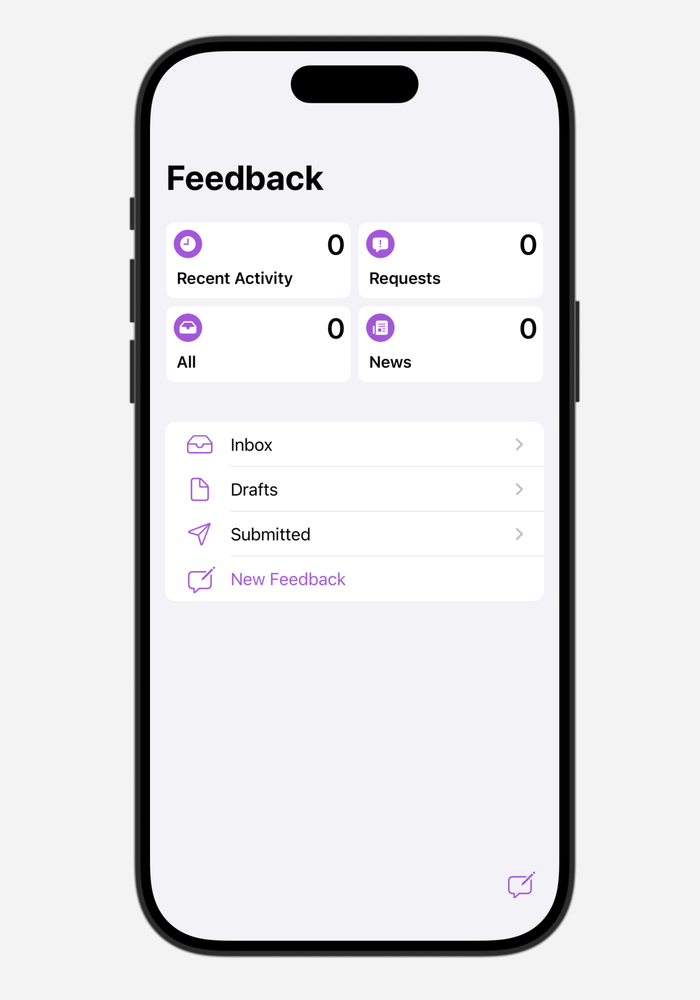

#  Feedback-Assistant-iOS
A **work-in-progress** SwiftUI recreation of the iOS & iPadOS Feedback Assistant app.

## Information
- This personal project is a recreation of Apple's Feedback Assistant app for iOS and iPadOS.

## Examples

## Usage
Open the project in Xcode and run with either a Simulator instance or physical device with Developer Mode enabled as a destination.

As this is a personal project for learning Swift and SwiftUI, feel free to download and modify the project for your own personal purposes.

## Disclaimers
- All assets such as icons and images are not my own in any way.
- This app is a recreation of Apple's own apps and designs for learning purposes only.
- Feel free to look through the commit history to see the project evolve from a single view to its current state.
- If you have any questions or feedback, please contact me through the options listed on my GitHub profile.

## Other Projects
- **iOS Settings** https://github.com/zhrispineda/Settings-iOS
- **iOS Notes** https://github.com/zhrispineda/Notes-iOS
- **visionOS Settings** https://github.com/zhrispineda/Settings-visionOS
- **visionOS Photos** https://github.com/zhrispineda/Photos-visionOS
- **watchOS Settings** https://github.com/zhrispineda/Settings-watchOS
- **ATVSpecs** https://github.com/zhrispineda/ATVSpecs
- **BrushTimer** https://github.com/zhrispineda/BrushTimer
